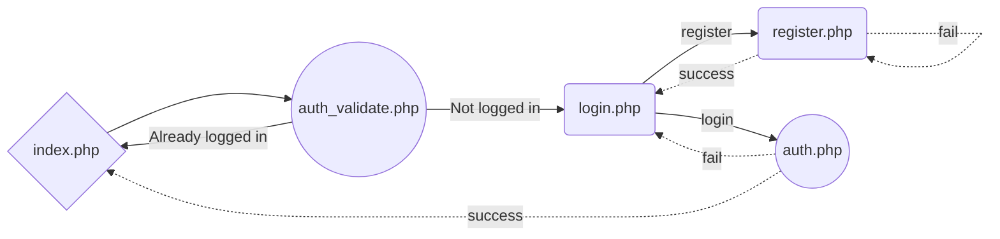

# 5Gewinnt

5Gewinnt ist das neue, knallharte und gnadenlose Multiplayer Game. Hier geht selbst der härteste in die Knie.
Projekt in **development**

## Common Vars
Ich bitte um eine **einheitliche** Variablennamen!
```
+-----------+--------------------------+
| var name  |  database item / session |
+-----------+--------------------------+
| userid    |  id                      |
| username  |  username                |
| passwd    |  passwort                |
| email     | email                    |
| ip        | ip_v4                    |
| reg_date  |  reg_date                |
| banned    | banned                   |
| s_id      |  series_id               |
| rem_tok   |  remember_token          |
| expires   |  expires                 |
+-----------+--------------------------+
```


## UML Login

Basic Login Structure



## UML Game
TBD
